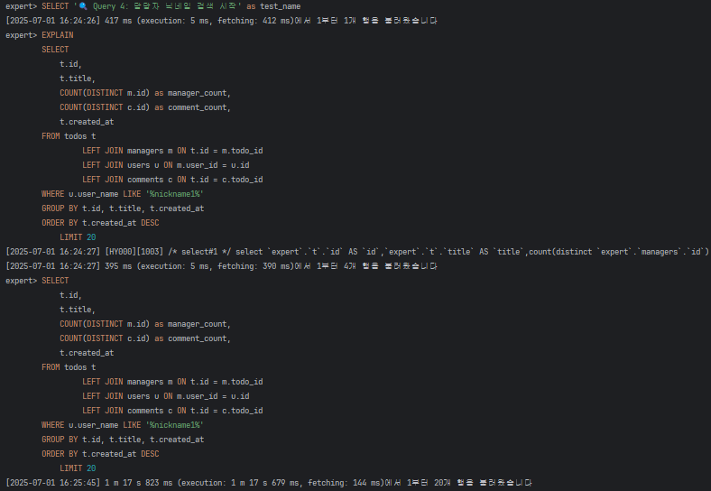
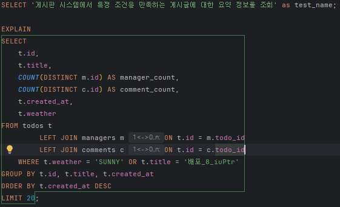

# SPRING PLUS
대용량 트래픽과 성능 개선을 테스트한 프로젝트입니다.

# 환경설정
1. resources 패키지에 application.yml 생성 후 아래와 같이 작성해주세요.
```
spring:
  datasource:
    url: 
    username: name
    password: password
    driver-class-name: com.mysql.cj.jdbc.Driver

  jpa:
    hibernate:
      ddl-auto: validate
    show-sql: true
    properties:
      hibernate:
        format_sql: true

jwt:
  secret:
    key: 

logging:
  level:
    org.springframework.web: DEBUG
    org.hibernate.SQL: DEBUG
    org.hibernate.type.descriptor.sql.BasicBinder: TRACE
``` 
2. 또한 이번에는 test 쪽에도 resources 패키지에 application-test.yml 을 생성 후 아래와 같이 작성해주세요.
```
spring:
  datasource:
    url: 
    username: 
    password: 
    driver-class-name: com.mysql.cj.jdbc.Driver

  jpa:
    hibernate:
      ddl-auto: none
    show-sql: false
    properties:
      hibernate:
        format_sql: false

jwt:
  secret:
    key: 

logging:
  level:
    org.springframework.web: ERROR
    org.hibernate.SQL: ERROR
    org.hibernate.type.descriptor.sql.BasicBinder: ERROR
```
3. 데이터베이스에서 MySQL 데이터소스와 스키마를 생성해주세요.
4. src/main/resources/db/schema/00_create_database.sql 을 실행해주세요.
5. src/main/resources/db/schema/01_create_tables_basic.sql 을 실행해주세요.
6. src/test/java/org.example.expert/domain/user 에서 UserBulkInsertTest를 실행해주시고 domain/todo 에서 TodoBulkInsertTest 도 실행해주세요. 차례대로 해주셔야합니다.
7. db/schema 에 위치한 기초 sql 들을 활용하여 진행하고자 하는 테스트를 진행하시면 됩니다.

   
# 외래키 자동 인덱스와 성능 최적화 분석

## 📈 문제 상황 발견
우선 초기에는 USER 100만명, TODO 200만개, MANAGER 240만명 그리고 COMMENT 400만개를 생성하고 조회속도를 비교했습니다. 하지만, 이는 인덱스를 적용하더라도 당연히 성능 차이가 없었고, 이를 개선하기 위해서는 fulltext Index를 사용해야하는데, 이는 추후에 일레스틱서치를 공부해보고 적용해보도록 하겠습니다. mysql에서 이런 검색 조건으로 조회하는 건 한계가 있다고 생각합니다. 그래서 저는 다른 쿼리로 테스트를 진행했습니다.


그리고 추가적으로 기존의 데이터에서 가장 최근날짜로 USER를 50명, TODO 20개, 이 TODO에 해당하는 매니저 20명 그리고 댓글 1000개씩을 추가했습니다.
하지만 프로젝트를 진행하면서 흥미로운 현상을 발견했습니다. 인덱스를 추가로 생성해도 쿼리 성능 개선 효과가 예상보다 미미했는데, 그 원인을 분석한 결과 **외래키 제약조건이 자동으로 생성하는 인덱스**가 이미 기본적인 조회 성능을 보장하고 있었기 때문임을 알게 되었습니다.

## 📈 외래키 자동 인덱스 현황

JPA와 MySQL의 외래키 제약조건은 자동으로 인덱스를 생성합니다. 현재 프로젝트의 자동 생성 인덱스 현황은 다음과 같습니다.

| 테이블 | 자동 생성 인덱스 | 생성 이유 | 최적화되는 작업 |
|--------|------------------|-----------|-----------------|
| **users** | `PRIMARY KEY (id)` | 기본키 | ID 기반 조회 |
| **todos** | `PRIMARY KEY (id)` | 기본키 | ID 기반 조회 |
| | `INDEX (user_id)` | 외래키 제약조건 | users와 JOIN |
| **managers** | `PRIMARY KEY (id)` | 기본키 | ID 기반 조회 |
| | `INDEX (user_id)` | 외래키 제약조건 | users와 JOIN |
| | `INDEX (todo_id)` | 외래키 제약조건 | todos와 JOIN |
| | `UNIQUE (todo_id, user_id)` | 중복 방지 제약조건 | 중복 체크 |
| **comments** | `PRIMARY KEY (id)` | 기본키 | ID 기반 조회 |
| | `INDEX (user_id)` | 외래키 제약조건 | users와 JOIN |
| | `INDEX (todo_id)` | 외래키 제약조건 | todos와 JOIN |

## 📈 외래키 인덱스가 이미 최적화하는 작업들

외래키 제약조건으로 자동 생성된 인덱스는 다음과 같은 작업들을 이미 최적화하고 있었습니다.

### ✅ 이미 최적화된 작업들

| 작업 유형 | 쿼리 예시 | 최적화 상태 | 성능 |
|-----------|-----------|-------------|------|
| **기본 JOIN** | todos와 users 조인 | ✅ 최적화됨 | 빠름 |
| **외래키 검색** | 특정 사용자의 todos 조회 | ✅ 최적화됨 | 빠름 |
| **댓글 조회** | 특정 todo의 comments 조회 | ✅ 최적화됨 | 빠름 |
| **담당자 조회** | 특정 todo의 managers 조회 | ✅ 최적화됨 | 빠름 |
| **ID 기반 조회** | 기본키를 통한 단건 조회 | ✅ 최적화됨 | 매우 빠름 |

### ❌ 여전히 최적화가 필요한 작업들

| 작업 유형 | 문제점 | 필요한 최적화 | 예상 성능 개선 |
|-----------|--------|---------------|----------------|
| **복합 조건 검색** | weather + created_at 동시 조건 | 복합 인덱스 필요 | 상당한 개선 |
| **정렬 최적화** | created_at 기준 정렬 | 정렬 전용 인덱스 | 중간 개선 |
| **텍스트 검색** | title, contents LIKE 검색 | 텍스트 인덱스 | 상당한 개선 |
| **집계 쿼리** | COUNT, GROUP BY 연산 | 집계 전용 인덱스 | 중간 개선 |
| **범위 검색** | 날짜 범위, 숫자 범위 조회 | 범위 검색 인덱스 | 상당한 개선 |

## 📈 실제 성능 테스트 결과

복잡한 집계 쿼리를 대상으로 성능 테스트를 진행한 결과는 다음과 같습니다.

### 📈 테스트 쿼리: 특정 조건의 todos와 관련 통계 조회

## 쿼리 성능 비교

| 최적화 단계 | 평균 실행 시간 | 개선율 | 주요 변경사항 |
|-------------|----------------|--------|---------------|
| **인덱스 없음** | 428ms | 기준 | 외래키 인덱스만 존재 |
| **created_at 인덱스 추가** | 436ms | -1.9% | 정렬 조건 인덱스 |
| **weather 인덱스 추가** | 386ms | 9.8% | WHERE 조건 인덱스 |
| **복합 인덱스 적용** | 387ms | 9.6% | 두 인덱스 동시 적용 |

## 📈 중요한 발견사항

### 1. 외래키 인덱스의 강력함
기본적인 JOIN과 관계 기반 조회는 이미 외래키 인덱스로 충분히 최적화되어 있었습니다. 이는 JPA의 연관관계 매핑이 자동으로 제공하는 성능 최적화 효과라고 볼 수 있습니다.

### 2. 제한적인 추가 인덱스 효과
단순한 컬럼별 인덱스 추가는 예상보다 효과가 제한적이었습니다. 이는 쿼리의 복잡성(복합 JOIN + GROUP BY + 집계 함수)으로 인해 단일 인덱스만으로는 전체 성능을 크게 개선하기 어렵기 때문입니다.

### 3. OR 조건의 한계
`WHERE weather = 'SUNNY' OR title = '배포_8_iuPtr'` 같은 OR 조건은 MySQL 옵티마이저가 인덱스를 효율적으로 활용하기 어려운 구조입니다. 이런 경우 쿼리 구조 자체의 개선이 인덱스 추가보다 더 효과적일 수 있습니다.

## 실무적 교훈

### 📈 성능 최적화 우선순위

| 우선순위 | 최적화 방법 | 효과 | 적용 시점 |
|----------|-------------|------|-----------|
| **1순위** | 쿼리 구조 개선 | 높음 | 개발 초기 |
| **2순위** | 적절한 연관관계 설정 | 높음 | 설계 단계 |
| **3순위** | 캐싱 전략 도입 | 높음 | 성능 이슈 발생시 |
| **4순위** | 복합 인덱스 생성 | 중간 | 특정 쿼리 최적화 |
| **5순위** | 단일 인덱스 추가 | 낮음 | 세부 튜닝 |

### 실제 서비스에서의 접근법

1. **화면별 데이터 분리**: 모든 정보를 한 번에 조회하지 않고, 필요한 정보만 단계적으로 로딩
2. **적절한 페이징**: 대용량 데이터는 적절한 크기로 나누어 조회
3. **캐싱 활용**: 변경 빈도가 낮은 집계 데이터는 캐시 활용
4. **비동기 처리**: 즉시 필요하지 않은 데이터는 백그라운드에서 처리

## 결론

외래키 제약조건이 자동으로 생성하는 인덱스는 이미 상당한 수준의 성능 최적화를 제공합니다. 따라서 추가적인 인덱스 최적화보다는 **쿼리 구조 개선, 적절한 데이터 분리, 캐싱 전략** 등이 더 효과적인 성능 개선 방법일 수 있습니다.

특히 실제 서비스에서는 모든 데이터를 한 번에 조회하려 하지 않고, 사용자가 실제로 필요로 하는 정보를 단계적으로 제공하는 것이 더 나은 사용자 경험과 성능을 동시에 달성할 수 있는 방법입니다.

추가적으로 테이블 연관관계를 끊고 응용 레이어에서 의존성을 갖는 상황에서 다시 성능 비교를 해보려고합니다. 그리고 이벤트 비동기 방식으로 CQRS 패턴을 적용하여 이에도 성능 비교를 해보려고합니다. 
